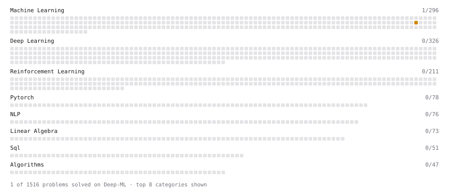

# Deep-ML

My machine learning practice from [Deep-ML](https://www.deep-ml.com). Every solution here was written by hand.

**14** solved · 7 problems · 0 labs · 7 math

[**Browse the interactive portfolio**](https://K3YB04RD-w4rri0r.github.io/deep-ml/) to replay this filling in over time.

## Problems

| | Difficulty | Solved | |
| --- | --- | --- | --- |
| [Derivative of a Polynomial](https://www.deep-ml.com/problems/116) | easy | 2026-06-29 | [solution](problems/0116-derivative-of-a-polynomial) |
| [Detect Overfitting or Underfitting](https://www.deep-ml.com/problems/86) | easy | 2026-10-03 | [solution](problems/0086-detect-overfitting-or-underfitting) |
| [Dot Product Calculator](https://www.deep-ml.com/problems/83) | easy | 2026-09-29 | [solution](problems/0083-dot-product-calculator) |
| [Random Train/Validation/Test Split with Shuffling](https://www.deep-ml.com/problems/1058) | easy | 2026-09-30 | [solution](problems/1058-random-train-validation-test-split-with-shuffling) |
| [Vector Norms (L1/L2/L-inf) and the Frobenius Norm](https://www.deep-ml.com/problems/328) | easy | 2026-09-29 | [solution](problems/0328-vector-norms-l1-l2-l-inf-and-the-frobenius-norm) |
| [Backpropagation Gradients for a Dense Layer](https://www.deep-ml.com/problems/1076) | medium | 2026-09-29 | [solution](problems/1076-backpropagation-gradients-for-a-dense-layer) |
| [Mini-Batch Gradient Descent Step for Linear Regression](https://www.deep-ml.com/problems/803) | medium | 2026-10-03 | [solution](problems/0803-mini-batch-gradient-descent-step-for-linear-regression) |

## Math

| | Difficulty | Solved | |
| --- | --- | --- | --- |
| [Descriptive Statistics](https://www.deep-ml.com/math-problems/18) | easy | 2026-09-30 | [solution](math/0018-descriptive-statistics) |
| [Expectation and Variance Algebra](https://www.deep-ml.com/math-problems/33) | easy | 2026-09-30 | [solution](math/0033-expectation-and-variance-algebra) |
| [Gradient Descent Updates](https://www.deep-ml.com/math-problems/5) | easy | 2026-09-30 | [solution](math/0005-gradient-descent-updates) |
| [ML Workflow Basics](https://www.deep-ml.com/math-problems/30) | easy | 2026-09-29 | [solution](math/0030-ml-workflow-basics) |
| [Precision and Recall at a Threshold](https://www.deep-ml.com/math-problems/127) | easy | 2026-10-04 | [solution](math/0127-precision-and-recall-at-a-threshold) |
| [Least Squares and the Normal Equations](https://www.deep-ml.com/math-problems/34) | medium | 2026-09-30 | [solution](math/0034-least-squares-and-the-normal-equations) |
| [Regularization and Generalization](https://www.deep-ml.com/math-problems/31) | medium | 2026-10-03 | [solution](math/0031-regularization-and-generalization) |

---

_This file is regenerated by Deep-ML on every push._
